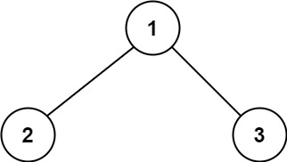

# 124. Binary Tree Maximum Path Sum - Hard

A <b>path</b> in a binary tree is a sequence of nodes where each pair of adjacent nodes in the sequence has an edge connecting them. A node can only appear in the sequence <b>at most once</b>. Note that the path does not need to pass through the root.

The <b>path sum</b> of a path is the sum of the node's values in the path.

Given the ```root``` of a binary tree, return the maximum <b>path sum</b> of any path.

##### Example 1:


```
Input: root = [1,2,3]
Output: 6
Explanation: The optimal path is 2 -> 1 -> 3 with a path sum of 2 + 1 + 3 = 6.
```

##### Example 2:


```
Input: root = [-10,9,20,null,null,15,7]
Output: 42
Explanation: The optimal path is 15 -> 20 -> 7 with a path sum of 15 + 20 + 7 = 42.
``` 

##### Constraints:

- The number of nodes in the tree is in the range ```[1, 3 * 104]```.
- ```-1000 <= Node.val <= 1000```

#### Java Solution
```java
public class TreeMaxPathSum {
    public static int maxPathSum(TreeNode root) {
        int[] res = new int[1];
        res[0] = Integer.MIN_VALUE;
        maxPathSumRe(root, res);
        return res[0];
    }

    static int maxPathSumRe(TreeNode root, int[] res) {
        if (root == null)
            return 0;
        int left = maxPathSumRe(root.left, res);
        int right = maxPathSumRe(root.right, res);
        res[0] = Math.max(res[0], root.val + Math.max(left, 0) + Math.max(right, 0));
        return Math.max(root.val, root.val + Math.max(left, right));
    }
}
```

#### [Java Source Code](../../../src/main/java/com/algorithm/treedatastructure/TreeMaxPathSum.java)