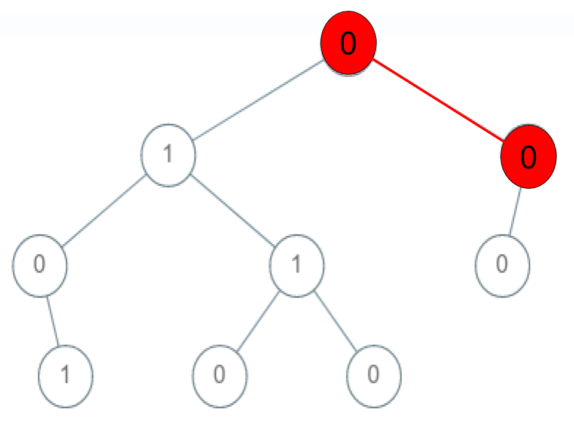

# Check If a String Is a Valid Sequence from Root to Leaves Path in a Binary Tree - Medium

Given a binary tree where each path going from the root to any leaf form a <b>valid sequence</b>, check if a given string is a valid sequence in such binary tree.

We get the given string from the concatenation of an array of integers ```arr``` and the concatenation of all values of the nodes along a path results in a <b>sequence</b> in the given binary tree.

##### Example 1:

```
Input: root = [0,1,0,0,1,0,null,null,1,0,0], arr = [0,1,0,1]
Output: true
Explanation: 
The path 0 -> 1 -> 0 -> 1 is a valid sequence (green color in the figure). 
Other valid sequences are: 
0 -> 1 -> 1 -> 0 
0 -> 0 -> 0
```

##### Example 2:

```
Input: root = [0,1,0,0,1,0,null,null,1,0,0], arr = [0,0,1]
Output: false 
Explanation: The path 0 -> 0 -> 1 does not exist, therefore it is not even a sequence.
```

##### Example 3:

```
Input: root = [0,1,0,0,1,0,null,null,1,0,0], arr = [0,1,1]
Output: false
Explanation: The path 0 -> 1 -> 1 is a sequence, but it is not a valid sequence.
```

##### Constraints:
- ```1 <= arr.length <= 5000```
- ```0 <= arr[i] <= 9```
- Each node’s value is between [0–9].

#### Java Solution
```java
public class PathWithGivenSequence {

    public static boolean isValidSequence(TreeNode root, int[] arr) {
        if (root == null) {
            return arr.length == 0;
        }
        return validSeqHelper(root, arr, 0);
    }

    static boolean validSeqHelper(TreeNode root, int[] arr, int i) {
        if (root == null || i >= arr.length || root.val != arr[i]) {
            return false;
        }
        if (root.left == null && root.right == null) {
            return true;
        }
        return validSeqHelper(root.left, arr, i + 1) || validSeqHelper(root.right, arr, i + 1);
    }
}
```

#### [Java Source Code](../../../src/main/java/com/algorithm/treedatastructure/PathWithGivenSequence.java)