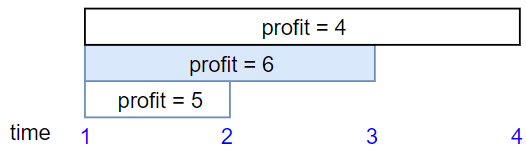

# 1235. Maximum Profit in Job Scheduling
We have ```n``` jobs, where every job is scheduled to be done from ```startTime[i]``` to ```endTime[i]```, obtaining a profit of ```profit[i]```.

You're given the ```startTime```, ```endTime``` and ```profit``` arrays, return the maximum profit you can take such that there are no two jobs in the subset with overlapping time range.

If you choose a job that ends at time X you will be able to start another job that starts at time X.

##### Example 1:


```
Input: startTime = [1,2,3,3], endTime = [3,4,5,6], profit = [50,10,40,70]
Output: 120
Explanation: The subset chosen is the first and fourth job. 
Time range [1-3]+[3-6] , we get profit of 120 = 50 + 70.
```

##### Example 2:


```
Input: startTime = [1,2,3,4,6], endTime = [3,5,10,6,9], profit = [20,20,100,70,60]
Output: 150
Explanation: The subset chosen is the first, fourth and fifth job. 
Profit obtained 150 = 20 + 70 + 60.
```

##### Example 3:


```
Input: startTime = [1,1,1], endTime = [2,3,4], profit = [5,6,4]
Output: 6
```

##### Constraints:

- 1 <= startTime.length == endTime.length == profit.length <= 5 * 10<sup>4</sup>
- 1 <= startTime[i] < endTime[i] <= 10<sup>9</sup>
- 1 <= profit[i] <= 10<sup>4</sup>

#### Java Solution
```java
public class MaximumProfitJobScheduling {

    public int jobScheduling(int[] startTime, int[] endTime, int[] profit) {
        List<Task> tasks = new ArrayList<>();
        for (int i = 0; i < profit.length; i++) {
            tasks.add(new Task(startTime[i], endTime[i], profit[i]));
        }
        Collections.sort(tasks, (u, v) -> {
            if (u.end > v.end) return 1;
            else if (u.end < v.end) return -1;
            else return 0;
        });

        Map<Integer, List<Task>> map = new HashMap<>();
        int maxTask = 0;
        for (Task t : tasks) {
            maxTask = Math.max(maxTask, t.end);
            map.compute(t.end, (k, v) -> v == null ? new ArrayList<Task>() : v).add(t);
        }
        int[] cache = new int[maxTask + 1];

        int maxProfit = 0;
        for (int i = 1; i < cache.length; i++) {
            List<Task> tList = map.get(i);
            if (tList == null)
                cache[i] = cache[i - 1];
            else {
                cache[i] = cache[i - 1];
                for (Task t : tList) {
                    cache[i] = Math.max(cache[i], t.profit + cache[t.start]);
                }
            }
            maxProfit = Math.max(maxProfit, cache[i]);
        }
        return maxProfit;
    }
    public class Task {
        public int start;
        public int end;
        public int profit;

        public Task(int start, int end, int profit) {
            this.start = start;
            this.end = end;
            this.profit = profit;
        }
    }
}
```

#### [Java Source Code](../../../src/main/java/com/algorithm/mergeintervals/MaximumProfitJobScheduling.java)