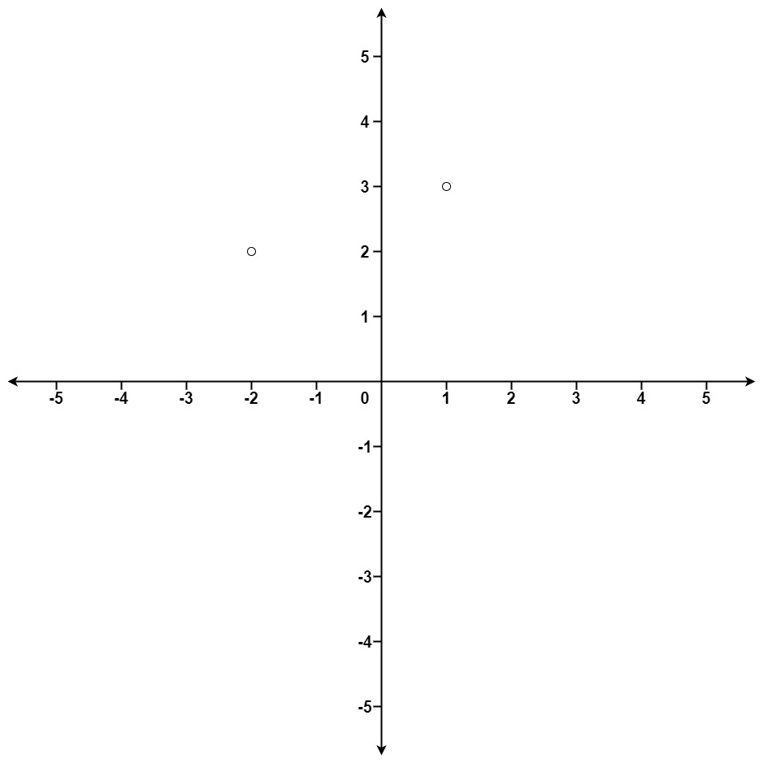

# 973. K Closest Points to Origin - Medium

Given an array of ```points``` where ```points[i] = [xi, yi]``` represents a point on the <b>X-Y</b> plane and an integer ```k```, return the ```k``` closest points to the origin ```(0, 0)```.

The distance between two points on the <b>X-Y</b> plane is the Euclidean distance <b>(i.e, √(x<sub>1</sub> - x<sub>2</sub>)<sup>2</sup> + (y<sub>1</sub> - y<sub>2</sub>)<sup>2</sup>)</b>.

You may return the answer in <b>any order<b>. The answer is <b>guaranteed<b> to be <b>unique<b> (except for the order that it is in).

 

##### Example 1:


```
Input: points = [[1,3],[-2,2]], k = 1
Output: [[-2,2]]
Explanation:
The distance between (1, 3) and the origin is sqrt(10).
The distance between (-2, 2) and the origin is sqrt(8).
Since sqrt(8) < sqrt(10), (-2, 2) is closer to the origin.
We only want the closest k = 1 points from the origin, so the answer is just [[-2,2]].
```

##### Example 2:

```
Input: points = [[3,3],[5,-1],[-2,4]], k = 2
Output: [[3,3],[-2,4]]
Explanation: The answer [[-2,4],[3,3]] would also be accepted.
``` 

##### Constraints:

- 1 <= k <= points.length <= 10<sup>4</sup>
- -10<sup>4</sup> < xi, yi < 10<sup>4</sup>

#### Java Solution
```java
public class KClosestPoints {
    public int[][] kClosest(int[][] points, int k) {
        PriorityQueue<int[]> queue = new PriorityQueue<>(k, (a, b) -> b[0] - a[0]);
        int m = points.length;
        for (int i = 0; i < m; i++) {
            int[] point = points[i];
            int dist = getDistance(point);
            if (i < k) {
                queue.offer(new int[] { dist, i });
                continue;
            }
            int[] distance = queue.peek();

            if (dist < distance[0]) {
                queue.poll();
                queue.offer(new int[] { dist, i });
            }
        }

        int[][] res = new int[k][2];

        int i = 0;
        for (int[] dist : queue) {
            res[i++] = points[dist[1]];
        }
        return res;
    }

    int getDistance(int[] point) {
        return point[0] * point[0] + point[1] * point[1];
    }
}
```

#### [Java Source Code](../../../src/main/java/com/algorithm/stacksandqueues/KClosestPoints.java)