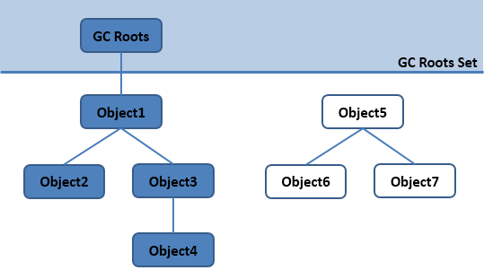

# GC算法与内存分配策略 [Back to JVM](README.md)
  GC主要回答了以下三个问题：
  
  - 哪些内存需要回收？
  - 什么时候回收？
  - 如何回收 
  
## 对象存活判定算法
   * 引用计数算法
        
     引用计数算法是在JVM中被摒弃的一种对象存活判定算法，不过它也有一些知名的应用场景（如Python、FlashPlayer）
     
     主要思想：<b>给对象中添加一个引用计数器，每当有一个地方引用它时，计数器加1；当引用失效时，计数器减1；任何时刻计数器为0的对象就是不可能再被使用的。</b>
     ```java
     public class ReferenceCountingGC {
     
         public Object instance = null;
     
         private static final int _1MB = 1024 * 1024;
     
         /** * 这个成员属性的唯一意义就是占点内存，以便在能在GC日志中看清楚是否有回收过 */
         private byte[] bigSize = new byte[2 * _1MB];
     
         public static void testGC() {
             ReferenceCountingGC objA = new ReferenceCountingGC();
             ReferenceCountingGC objB = new ReferenceCountingGC();
             objA.instance = objB;
             objB.instance = objA;
     
             objA = null;
             objB = null;
     
             // 假设在这行发生GC，objA和objB是否能被回收？
             System.gc();
         }
     }
     ```
   * 可达性分析算法
     
     通过一系列的称为“GC Roots”的对象作为起点，从这些节点向下搜索，搜索所走过的路径称为引用链（Reference Chain），当一个对象到GC Roots没有任何引用链相连（用图论的话来说，就是GC Roots 到这个对象不可达）时，则证明此对象时不可用的。
     
     
     上图中，对象object 5、object 6、object 7虽然互有关联，但是它们到GC Roots是不可达的，所以它们将会被判定为是可回收的对象。
     
     GC Roots其实不是一组对象，而通常是一组特别管理的指向引用类型对象的指针。<b>只有引用类型的变量才被认为是Roots，值类型的变量永远不被认为是Roots。</b>
     GC Roots的对象包括以下几种:
        - 虚拟机栈（栈帧中的局部变量表，Local Variable Table）中引用的对象
        - 方法区中类静态属性引用的对象
        - 方法区中常量引用的对象
        - 本地方法栈中JNI（即一般说的Native方法）引用的对象
     
     #### **两次标记与 finalize()方法**
     
     即使在可达性分析算法中不可达的对象，也不是一定会死亡的，它们暂时都处于“缓刑”阶段，要真正宣告一个对象“死亡”，至少要经历两次标记过程：
     - 当对象没有覆盖finaliza()方法
     - finaliza()方法已经被虚拟机调用过
     
     如果这个对象被判定为有必要执行finaliza()方法，那么此对象将会放置在一个叫做 F-Queue 的队列中，并在稍后由一个虚拟机自动建立的、低优先级的Finalizer线程去执行它。这里所谓的“执行”是指虚拟机会触发此方法，但并不承诺会等待它运行结束，原因是：如果一个对象在finaliza()方法中执行缓慢，或者发生了死循环（更极端的情况），将很可能导致F-Queue 队列中的其它对象永久处于等待，甚至导致整个内存回收系统崩溃。
     
   * 回收方法区
   
     元空间的内存管理由元空间虚拟机来完成。
     在元空间中，类和其元数据的生命周期和其对应的类加载器是相同的。话句话说，只要类加载器存活，其加载的类的元数据也是存活的，因而不会被回收掉。

# 垃圾收集算法
  
   * 标记－清除（Mark-Sweep）算法
   
     主要思想：算法分成“标记”、“清除”两个阶段：首先标记出所有需要回收的对象，在标记完成后统一回收所有被标记的对象。标记－清除的执行过程如下图所示：
     
     

     标记－清除算法的不足主要有以下两点
        - 空间问题，标记清除之后会产生大量不连续的内存碎片，空间碎片太多可能会导致以后在程序运行过程中需要分配较大对象时，无法找到足够的连续内存而不得不触发另一次垃圾收集动作。
        - 效率问题，因为内存碎片的存在，操作会变得更加费时，因为查找下一个可用空闲块已不再是一个简单操作。
      
   * 复制（Copying）算法
     
     主要思想：它将可用内存按容量分成大小相等的两块，每次只使用其中的一块。当这一块内存用完，就将还存活着的对象复制到另一块上面，然后再把已使用过的内存空间一次清理掉。
     复制算法的执行过程如下图所示：
     
          
      
   * 标记－整理（Mark-Compact）算法
   
     主要思想: 让所有存活的对象都向一端移动，然后直接清理掉边界以外的内存。具体示意图如下所示：
     
     
     
   * 分代收集（Generational Collection）算法
   
     主要思想为：根据对象存活周期的不同将内存划分为几块，一般是把Java堆分为新生代和老年代，这样就可以根据各个年代的特点采用最适合的收集算法：
    
        - 新生代 在新生代中，每次垃圾收集时都发现有大批对象死去，只有少量存活，那就选用复制算法，只需要付出少量存活对象的复制成本就可以完成收集。
        - 老年代 在老年代中，因为对象存活率高、没有额外空间对它进行分配担保，就必须使用“标记-清除”或“标记-整理”算法来进行回收。
        
     

# HotSpot的算法实现

   * 枚举根节点
        - GC停顿（”Stop The World”）
           
           在整个分析期间整个执行系统看起来就像被冻结在某个时间点上，不可以出现分析过程中对象引用关系还在不断变化的情况，这是保证分析结果准确性的基础。这点是导致GC进行时必须停顿所有Java执行线程（Sun将这件事情称为“Stop The World”）的其中一个重要原因。
        - 准确式GC与OopMap(Ordinary Object Pointer)
           OopMap用于记录下栈和寄存器中的哪些位置为引用。在类加载完成后，HotSpot就把对象内什么偏移量上是什么类型的数据计算出来。在JIT编译过程中，在安全点的时候记录下偏移量上的数据类型。
           虚拟机通过扫描OopMap得知哪些地方存放着对象引用
   * 安全点（Safepoint）- 进行GC时程序停顿的位置
        
        导致引用关系变化，或者说OopMap内容变化的指令非常多，如果为每一条指令都生成对应的OopMap，那将会需要大量的额外空间，这样GC的空间成本将会变得很高。
        为此，HotSpot选择不为每条指令都生成OopMap，而是只在“特定的位置”记录这些信息，这些位置便被称为安全点（Safepoint）
        
        安全点的选定基本上是以程序“是否具有让程序长时间执行的特征”为标准进行选定的。“长时间执行”的最明显特征就是指令序列复用，如下：
        - 方法调用
        - 循环跳转
        - 异常跳转
      
        如何在GC发生时让所有线程（这里不包括执行JNI调用的线程）都“跑”到最近的安全点上再停顿下来。
        - 抢先式中断（Preemptive Suspension）
        
          在GC发生时，首先把所有线程全部中断，如果发现有线程中断的地方不在安全点上，就恢复线程，让它“跑”到安全点上。
          
        - 主动式中断（Voluntary Suspension）
          
          当GC需要中断线程的时候，不直接对线程操作，仅仅简单地设置一个标志，各个线程执行时主动去轮询这个标志，发现中断标志为真时就自己中断挂起。轮询标志的地方和安全点是重合的，另外再加上创建对象需要分配内存的地方。
         
   * 安全区域（Safe Region）
        
        安全区域是指在一段代码片段之中，引用关系不会发生变化。在这个区域中的任意地方开始GC都是安全的。
       
        在线程执行到Safe Region中的代码时，首先标识自己已经进入了Safe Region，那样，当在这段时间里JVM要发起GC时，就不用管标识自己为Safe Region状态的线程了。在线程要离开Safe Region时，它要检查系统是否已经完成了根节点枚举（或者是整个GC过程），如果完成了，那线程就继续执行，否则它就必须等待直到收到可以安全离开Safe Region的信号为止。

# 内存分配策略
   Java的自动内存管理最终可以归结为自动化地解决了两个问题： 一是给对象分配内存，二是回收分配给对象的内存。
   * 对象优先在Eden区分配
        
     大多数情况下，对象在新生代的Eden区中分配。当Eden区没有足够空间进行分配时，虚拟机将发起一次Minor GC。

   * 大对象直接进入老年代
   
     大对象是指，需要大量连续内存空间的Java对象，最典型的大对象就是很长的字符串以及数组。
     
   * 长期存活的对象进入老年代
   
     虚拟机给每个对象定义了一个对象年龄（Age）计数器。如果对象在Eden出生并经过第一次Minor GC后仍然存活，并且能被Survivor容纳的话，将被移动到Survivor空间中，并且对象年龄设为1。对象在Survivor区中每“熬过”一次Minor GC，年龄就增加1岁，当它的年龄增加到一定程度（默认为15岁），就将会被晋升到老年代中。

   * 动态对象年龄判定
     
     如果在Survivor空间中相同年龄所有对象大小的总和大于Survivor空间的一半，年龄大于或等于该年龄的对象就可以直接进入老年代，无须等到MaxTenuringThreshold中要求的年龄。
     
   * 空间分配担保
   
     在发生Minor GC之前，虚拟机会先检查老年代最大可用的连续空间是否大于新生代所有对象总空间，如果这个条件成立，那么Minor GC可以确保是安全的。如果不成立，则虚拟机会查看HandlePromotionFailure设置值是否允许担保失败。如果允许，那么会继续检查老年代最大可用的连续空间是否大于历次晋升到老年代对象的平均大小，如果大于，将尝试着进行一次Minor GC，尽管这次Minor GC是有风险的；如果小于，或者HandlePromotionFailure设置不允许冒险，那这时也要改为进行一次Full GC。

# Full GC的触发条件

  对于Minor GC，其触发条件非常简单，当Eden区空间满时，就将触发一次Minor GC。而Full GC则相对复杂，因此本节我们主要介绍Full GC的触发条件。
    
  * 调用System.gc()
  
    此方法的调用是建议JVM进行Full GC,虽然只是建议而非一定,但很多情况下它会触发 Full GC,从而增加Full GC的频率,也即增加了间歇性停顿的次数。因此强烈建议能不使用此方法就不要使用，让虚拟机自己去管理它的内存，可通过-XX:+ DisableExplicitGC来禁止RMI调用System.gc()。
  
  * 老年代空间不足
  
    老年代空间不足的常见场景为前文所讲的大对象直接进入老年代、长期存活的对象进入老年代等，当执行Full GC后空间仍然不足，则抛出如下错误： Java.lang.OutOfMemoryError: Java heap space 为避免以上两种状况引起的Full GC，调优时应尽量做到让对象在Minor GC阶段被回收、让对象在新生代多存活一段时间及不要创建过大的对象及数组。
  
  * 空间分配担保失败
  
    使用复制算法的Minor GC需要老年代的内存空间作担保，如果出现了HandlePromotionFailure担保失败，则会触发Full GC
  
  * JDK 1.7及以前的永久代空间不足
  
    在JDK 1.7及以前，HotSpot虚拟机中的方法区是用永久代实现的，永久代中存放的为一些class的信息、常量、静态变量等数据，当系统中要加载的类、反射的类和调用的方法较多时，Permanet Generation可能会被占满，在未配置为采用CMS GC的情况下也会执行Full GC。如果经过Full GC仍然回收不了，那么JVM会抛出如下错误信息： java.lang.OutOfMemoryError: PermGen space 为避免PermGen占满造成Full GC现象，可采用的方法为增大PermGen空间或转为使用CMS GC。
    
    在JDK 1.8中用元空间替换了永久代作为方法区的实现，元空间是本地内存，因此减少了一种Full GC触发的可能性。
    
  * Concurrent Mode Failure
  
    执行CMS GC的过程中同时有对象要放入老年代，而此时老年代空间不足（有时候“空间不足”是CMS GC时当前的浮动垃圾过多导致暂时性的空间不足触发Full GC），便会报Concurrent Mode Failure错误，并触发Full GC。

# Return
- Java虚拟机 [JVM](README.md)          