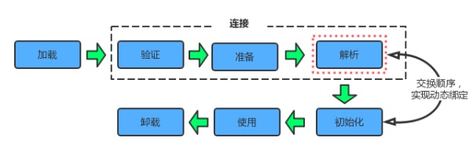
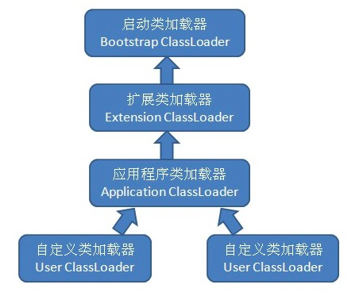
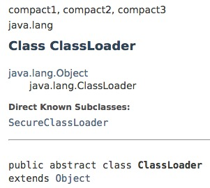
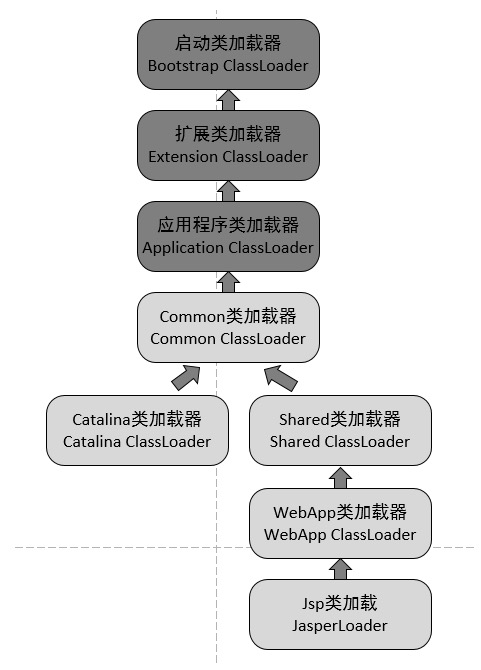

# 类加载过程概览 [Back to JVM](README.md)
  类从被加载到虚拟机内存中开始，到卸载出内存为止，它的整个生命周期包括以下7个阶段：
  
  - **加载（Loading）**
  - **连接（Linking）**
    - **验证（Verification）**
    - **准备（Preparation）**
    - **解析（Resolution）**
  - **初始化（Initialization）**
  - 使用（Using）
  - 卸载（Unloading）  
  
  这7个阶段的发生顺序如下图：
  
  
  
  加载、验证、准备、初始化和卸载这5个阶段的顺序是确定的，类的加载过程必须按照这种顺序按部就班地开始（开始而不是完成，这些阶段是互相交叉着进行的，在一个阶段执行过程中就会激活另一个阶段），而解析阶段则不一定：它在某些情况下可以在初始化阶段之后再开始，这是为了支持Java的运行时绑定（也称为动态绑定或晚期绑定）。

# 类初始化的时机
  对于初始化阶段，jvm规范严格规定了有且只有下列5种情况必须对类进行“初始化”（很自然地，加载、验证、准备需要在此之前开始）：
  
  - 遇到new、getstatic、putstatic、invokestatic这四条字节码指令时，如果类没有进行过初始化，则必须先触发其初始化。最常见的生成这4条指令的场景是：使用new关键字实例化对象的时候；读取或设置一个类的静态字段（被final修饰、已在编译期把结果放入常量池的静态字段除外）的时候；以及调用一个类的静态方法的时候。
  
  - 使用 java.lang.reflect包的方法对类进行反射调用的时候，如果类没有进行初始化，则需要先触发其初始化。
  
  - 当初始化一个类的时候，如果发现其父类还没有进行过初始化，则需要先触发其父类的初始化。
  
  - 当虚拟机启动时，用户需要制定一个要执行的主类（包含main方法的那个类），虚拟机会先初始化这个主类；
  
  - 当使用jdk1.7 的动态语言支持时，如果一个java.lang.invoke.MethodHandle实例最后的解析结果REF_getStatic, REF_putStatic, REF_invokeStatic 的方法句柄，并且这个方法句柄所对应的类没有进行过初始化，则需要先触发其初始化；
  
  以上5种场景中的行为称为对一个类进行主动引用。除此之外，所有引用类的方式都不会触发初始化，称为被动引用。被动引用的常见例子包括：
  
  - 通过子类引用父类的静态字段，不会导致子类初始化。
  
  - 通过数组定义来引用类，不会触发此类的初始化，如SuperClass[] sca = new SuperClass[10];。
  
  - 常量在编译阶段会存入调用类的常量池中，本质上并没有直接引用到定义常量的类，因此不会触发定义常量的类的初始化。
  
  接口的加载过程和类加载过程略有不同，它们真正的区别在于在前文提到的5种需要开始初始化场景中的第3种：当一个类在初始化时，要求其父类全部都已经初始化过了，但是一个接口在初始化时，并不要求其父接口全部都完成了初始化，只有在真正使用到父接口的时候（如引用接口中定义的常量）才会初始化。
  
# 类加载过程详解
  - **加载**
    
    虚拟机规范规定了在在加载阶段，jvm需要完成以下三件事情：
    - 通过一个类的全限定名来获取定义此类的二进制字节流。
    - 将这个字节流所代表的静态存储结构转化为方法区的运行时存储结构。
    - 在内存中生成一个代表这个类的java.lang.Class对象，作为方法区这个类的各种数据的访问入口。
    
    这三点要求不算具体，在jvm实现时灵活度很大。例如上面的第一条，它没有指明二进制字节流要从一个Class文件中获取，准确地说没有指明要从哪里获取、怎样获取。这也为许多Java技术提供了基础，例如：
    - 从ZIP包读取，这很常见，最终成为日后JAR、EAR、WAR格式的基础。
    
    - 从网络中获取，这种场景最典型的应用是Applet。
    
    - 运行时计算生成，这种场景使用得最多得就是动态代理技术，在java.lang.reflect.Proxy中，就是用了ProxyGenerator.generateProxyClass的代理类的二进制字节流。
    
    - 由其他文件生成，典型场景是JSP应用，即由JSP文件生成对应的Class类。
    
    - 从数据库读取，这种场景相对少见，例如有些中间件服务器（如SAP Netweaver）可以选择把程序安装到数据库中来完成程序代码在集群间的分发。
    
    ### 非数组类的加载
    相对于类加载过程的其他阶段，一个非数组类的加载阶段（准确地说，是加载阶段中获取类的二进制字节流的动作）是开发人员可控性最强的，因为加载阶段既可以使用系统提供的引导类加载器完成，也可以由用户自定义的类加载器完成，通过自定义类加载器去控制字节流的获取方式，即重写一个类加载器的loadClass()方法。
    
    ### 数组类的加载
    <b>数组类本身不通过类加载器创建，它是由jvm直接创建的。</b>但数组类的元素类型（Element Type，指的是数组去掉所有维度的类型）最终是要靠类加载器去创建，一个数据类C的创建过程遵循以下规则：
    
    - 如果数组的组件类型（ComponentType，指的是数组去掉一个维度的类型）是引用类型，就递归采用本节中定义的加载过程去加载此组件类型，数组类将在加载该组件类型的类加载器的类名称空间上被标识（一个类必须与类加载器一起确定唯一性）。
      
    - 如果数组的组件类型不是引用类型（例如int[]数组），Java虚拟机将会把数组类标记为与引导类加载器关联。
    
    - 数组类的可见性与它的组件类型的可见性一致，如果组件类型不是引用类型，那数组类的可见性将默认为public。
    
    加载阶段完成后，虚拟机外部的二进制字节流就按照虚拟机所需的格式存储在方法区之中，方法区的数据存储格式由虚拟机实现自行定义，虚拟机规范未规定此区域的具体数据结构。然后在内存中实例化一个java.lang.Class类的对象（并无明确规定是在Java 堆中，对于HotSpot虚拟机而言，Class对象比较特殊，它虽是对象，但存放在方法区里），这个对象将作为程序访问方法区中的这些类型数据的外部接口。
  
  - **验证**
    
    验证是连接阶段的第一步，这一阶段的目的是确保输入的Class文件的字节流能正确地解析并存储于方法区之内，格式上符合描述一个Java类型信息的要求，并且不会危害虚拟机自身的安全。
    从整体上看，验证阶段大致上会完成下面四个阶段的检验动作：文件格式验证、元数据验证、字节码验证、符号引用验证。
    
    - **文件格式验证**
    
      要验证字节流是否符合Class文件格式的规范，并且能被当前版本的虚拟机处理。这一阶段可能包括下面这些验证点：
      - 是否以魔数0xCAFEBABE开头。
      - 主次版本号是否在当前虚拟机的处理范围之内
      - 常量池的常量中是否有不被支持的常量类型（tag标志）。
      - 指向常量的各种索引值中是否有指向不存在的常量或不符合类型的常量。
      - Class文件中各个部分及文件本身是否有被删除的或附加的其他信息。 ……
    
      这阶段的验证是基于二进制字节流进行的，只有通过了这个阶段的验证后，字节流才会进入方法区中进行存储，所以后面的3个验证阶段全部是基于方法区的存储结构进行的，不会再直接操作字节流。
    
    - **元数据验证**
    
      对字节码描述的信息（即类的元数据信息）进行语义分析，以保证其描述的信息符合Java语言规范的要求。例如下面这些验证点：
      - 该类是否有父类（除了java.lang.Object之外，所有的类都应有父类）
      - 该类的父类是否继承了不允许被继承的类（final修饰的类）
      - 若此类不是抽象类，是否实现了其父类或接口之中要求实现的所有方法 ……
      
      该阶段的主要目的是对类的元数据信息进行语义检验，保证不存在不符合Java语言规范的元数据信息。
    
    - **字节码验证**
      
      主要是进行数据流和控制流分析。对类的方法体进行校验分析，以保证被校验类的方法在运行时不会做出危害虚拟机安全的行为。例如：
      - 保证任意时刻操作数栈的数据类型与指令代码序列都能配合工作。
      - 保证跳转指令不会跳转到方法体以外的字节码指令上。
      - 保证方法体中类型转换是有效的，例如子类对象可以赋值给父类数据类型，但父类对象赋值给子类数据类型是危险和不合法的。 ……
      
    - **符号引用验证**
     
      对类自身以外（常量池中的各种符号引用）的信息进行匹配性校验，通常需要校验下列内容：
      - 符号引用中通过字符串描述的全限定名是否能找到对应的类。
      - 指定的类中是否存在符合描述符与简单名称描述的方法与字段。
      - 符号引用中的类、字段、方法的访问性（private、protected、public、default）是否可被当前类访问。 ……
      
      对于jvm的类加载机制来说，验证阶段是一个非常重要但不是一定必要（因为对运行期没有影响）的阶段。如果所运行的全部代码都已经被反复验证过，那么在实施阶段就可以考虑使用`-Xverify:none`参数来关闭大部分的类验证措施，以缩短虚拟机类加载的时间。
  
  - **准备**
    
    准备阶段的主要任务是如下两点：
    
    - **为类变量分配内存**
    - **设置类变量初始值**
    
    这些变量所使用的内存都将在方法区中分配。
    首先，在准备阶段进行内存分配的仅包括类变量（被static修饰的变量），而不包括实例变量，实例变量将会在对象实例化时随着对象一起分配在Java堆中。
    其次，这里所说的初始值“通常情况”下是数据类型的零值，假设一个类变量的定义为：
    ```
    public static int value = 123;
    ```
    
    那变量value在准备阶段过后的初始值为0而不是123，因为这时候尚未开始执行任何Java方法，而把value赋值为123的putstatic指令是程序被编译后，存放于类构造器\<clinit>()方法之中，所以把value赋值为123的动作在初始化阶段才会执行。 值得注意的是，如果类字段的字段属性中存在ConstantValue属性，那在准备阶段变量value就会被初始化为ConstantValue属性所指定的值，假设上面类变量value的定义变为：
    ```
    public static final int value = 123;
    ``` 
    编译时Javac将会为value生成ConstantValue属性，在准备阶段虚拟机就会根据ConstantValue的设置将value赋值为123。
    
  - **解析**
    
    解析阶段是虚拟机将常量池内的符号引用替换为直接引用的过程。符号引用和直接引用的关联如下：
    - **符号引用（Symbol References）**
      
      符号引用以一组符号来描述所引用的目标，符号可以是任何形式的字面量，只要使用时能无歧义地定位到目标即可。符号引用与虚拟机实现的内存布局无关，引用的目标并不一定已经加载到内存中。各种虚拟机实现的内存布局可以各不相同，但是它们能接受的符号引用必须一致，因为符号引用的字面量形式明确定义在Java虚拟机规范的Class文件格式中。
    - **直接引用（Direct References）**
      
      直接引用可以是直接目标的指针、相对偏移量或是一个能间接定位到目标的句柄。直接引用是和虚拟机实现的内存布局有关的，同一个符号引用在不同虚拟机实例上翻译出来的直接引用一般不会相同。如果有了直接引用，那么引用的目标必定已经在内存中存在。
    
    解析动作主要针对以下7类符号引用
    
    - 类或接口
    - 字段
    - 类方法（静态方法）
    - 接口方法
    - 方法类型
    - 方法句柄
    - 调用点限定符
   
    其中后三种与java的动态语言支持息息相关。
    
  - **初始化**
    
    类初始化阶段是“类加载过程”中最后一步，在之前的阶段，除了在加载阶段用户应用程序可以通过自定义类加载器参与之外，其它动作完全由虚拟机主导和控制，直到初始化阶段，才真正开始执行类中定义的Java程序代码（或者说是字节码）。
    
    在准备阶段，变量已经赋过一次系统要求的初始值，而在初始化阶段，根据程序员通过程序制定的主观计划去初始化类变量和其它资源，简单说，初始化阶段即虚拟机执行类构造器\<clinit>()方法的过程。
    
    下面来详细讲解\<clinit>()方法是怎么生成的，首先来了解此方法执行过程中可能会影响到程序运行行为的特点和细节：
    
    - \<clinit>()方法是由编译器自动收集类中所有类变量的赋值动作和静态语句块（static{} 块）中的语句合并产生的，编译器收集的顺序由语句在源文件中出现的顺序决定，特别注意的是，静态语句块只能访问到定义在它之前的类变量，定义在它之后的类变量只能赋值，不能访问。例如以下代码：
    
      ```
      public class Test {
          static {
              i = 0;  // 给变量复制可以正常编译通过
              System.out.print(i);  // 这句编译器会提示“非法向前引用” 
          }
          static int i = 1;
      }
      ```
    - \<clinit>()方法与类的构造函数（或者说实例构造器<init>() 方法）不同，不需要显式的调用父类的()方法。虚拟机会自动保证在子类的\<clinit>()方法运行之前，父类的\<clinit>()方法已经执行结束。因此虚拟机中第一个执行\<clinit>()方法的类肯定为java.lang.Object。
    
    - 由于父类的\<clinit>()方法先执行，也就意味着父类中定义的静态语句块要优于子类的变量赋值操作。例如以下代码：
    
      ```
      static class Parent {
          public static int A = 1;
          static {
              A = 2;
          }
      }
      
      static class Sub extends Parent {
          public static int B = A;
      }
      
      public static void main(String[] args) {
          System.out.println(Sub.B);//输出结果是父类中的静态变量值A，也就是2
      }
      ``` 
    - \<clinit>()方法对于类或接口不是必须的，如果一个类中不包含静态语句块，也没有对类变量的赋值操作，编译器可以不为该类生成\<clinit>()方法。
      
    - 接口中不可以使用静态语句块，但仍然有类变量初始化的赋值操作，因此接口与类一样都会生成\<clinit>()方法。但接口与类不同的是，执行接口的\<clinit>()方法不需要先执行父接口的\<clinit>()方法。只有当父接口中定义的变量使用时，父接口才会初始化。另外，接口的实现类在初始化时也一样不会执行接口的\<clinit>()方法。
      
    - 虚拟机会保证一个类的\<clinit>()方法在多线程环境下被正确的加锁和同步，如果多个线程同时初始化一个类，只会有一个线程执行这个类的\<clinit>()方法，其它线程都会阻塞等待，直到活动线程执行\<clinit>()方法完毕。如果在一个类的\<clinit>()方法中有耗时的操作，就可能造成多个进程阻塞，在实际过程中此种阻塞很隐蔽。
    
# 类加载器

  虚拟机设计团队把类加载阶段中的“**通过一个类的全限定名来获取描述此类的二进制字节流(即字节码)**”这个动作放到Java虚拟机外部去实现，以便让应用程序自己决定如何去获取所需要的类。实现这个动作的代码模块称为“**类加载器**”。
  
  一般来说，Java 虚拟机使用 Java 类的方式如下：
  
  - Java 源程序（.java 文件）在经过 Java 编译器编译之后就被转换成字节码（.class 文件）。
  
  - 类加载器负责读取 Java 字节代码，并转换成 java.lang.Class类的一个实例。每个这样的实例用来表示一个 Java 类。通过此实例的 newInstance()方法就可以创建出该类的一个对象。
  
  ### 类与类加载器
  
  **对于任意一个类，都需要由加载它的类加载器和这个类本身一同确立其在Java虚拟机中的唯一性，每一个类加载器，都拥有一个独立的类名称空间**。通俗而言：比较两个类是否“相等”（这里所指的“相等”，包括类的Class对象的equals()方法、isAssignableFrom()方法、isInstance()方法的返回结果，也包括使用instanceof()关键字对做对象所属关系判定等情况），只有在这两个类时由同一个类加载器加载的前提下才有意义，否则，**即使这两个类来源于同一个Class文件，被同一个虚拟机加载，只要加载它们的类加载器不同，那这两个类就必定不相等**。
  
  ### 双亲委派模型
  
  从jvm的角度来讲，只存在以下两种不同的类加载器：
  
   - **启动类加载器（Bootstrap ClassLoader）**，这个类加载器用C++实现，是虚拟机自身的一部分；
   
   - **所有其他类的加载器**，这些类由Java实现，独立于虚拟机外部，并且全都继承自抽象类java.lang.ClassLoader。

   从Java开发人员的角度看，类加载器可以划分得更细致一些：
   
   - **启动类加载器（Bootstrap ClassLoader）** 此类加载器负责将存放在 <JAVA_HOME>\lib 目录中的，或者被 -Xbootclasspath 参数所指定的路径中的，并且是虚拟机识别的（仅按照文件名识别，如 rt.jar，名字不符合的类库即使放在lib 目录中也不会被加载）类库加载到虚拟机内存中。 启动类加载器无法被 Java 程序直接引用，用户在编写自定义类加载器时，如果需要把加载请求委派给引导类加载器，直接使用null代替即可。
   
   - **扩展类加载器（Extension ClassLoader）** 这个类加载器是由ExtClassLoader（sun.misc.Launcher$ExtClassLoader）实现的。它负责将<Java_Home>/lib/ext或者被 java.ext.dir系统变量所指定路径中的所有类库加载到内存中，开发者可以直接使用扩展类加载器。
   
   - **应用程序类加载器（Application ClassLoader）** 这个类加载器是由 AppClassLoader（sun.misc.Launcher$AppClassLoader）实现的。由于这个类加载器是ClassLoader中的getSystemClassLoader()方法的返回值，因此一般称为系统类加载器。它负责加载用户类路径（ClassPath）上所指定的类库，开发者可以直接使用这个类加载器，如果应用程序中没有自定义过自己的类加载器，一般情况下这个就是程序中默认的类加载器。
   
 由开发人员开发的应用程序都是由这三种类加载器相互配合进行加载的，如果有必要，还可以加入自己定义的类加载器。这些类加载器的关系一般如下图所示：
 
 
 
 上图展示的类加载器之间的层次关系，称为**类加载器的双亲委派模型（Parents Delegation Model）**。该模型要求除了顶层的启动类加载器外，其余的类加载器都应有自己的父类加载器，这里类加载器之间的父子关系一般通过**组合（Composition）关系**来实现，而不是通过**继承（Inheritance）的关系**实现。
 
  #### 工作过程
   
  如果一个类加载器收到了类加载的请求，它首先不会自己去尝试加载，而是把这个请求委派给父类加载器，每一个层次的加载器都是如此，依次递归，因此**所有的加载请求最终都应该传送到顶层的启动类加载器**中，只有当父加载器反馈自己无法完成此加载请求（它搜索范围中没有找到所需类）时，子加载器才会尝试自己加载。
  
  #### 优点
  
  使用双亲委派模型来组织类加载器之间的关系，使得Java类随着它的类加载器一起具备了一种带有优先级的层次关系。例如类java.lang.Object，它存放再rt.jar中，无论哪个类加载器要加载这个类，最终都是委派给处于模型最顶端的启动类加载器进行加载，因此Object类在程序的各种类加载器环境中都是同一个类。
  
  相反，如果没有双亲委派模型，由各个类加载器自行加载的话，如果用户编写了一个称为java.lang.Object的类，并放在程序的ClassPath中，那系统中将会出现多个不同的Object类，程序将变得一片混乱。如果开发者尝试编写一个与rt.jar类库中已有类重名的Java类，将会发现可以正常编译，但是永远无法被加载运行。
  
  双亲委派模型的实现如下：
  
  ```
  protected synchronized Class<?> loadClass(String name, boolean resolve) throws ClassNotFoundException {
      //check the class has been loaded or not
      Class c = findLoadedClass(name);
      if (c == null) {
          try {
              if (parent != null) {
                  c = parent.loadClass(name, false);
              } else {
                  c = findBootstrapClassOrNull(name);
              }
          } catch (ClassNotFoundException e) {
              //if throws the exception ,the father can not complete the load
          }
          if (c == null) {
              c = findClass(name);
          }
      }
      if (resolve) {
          resolveClass(c);
      }
      return c;
  }
  ```
  
# 破坏双亲委派模型
  
  ### 线程上下文类加载器
  
  双亲委派模型并不能解决 Java 应用开发中会遇到的类加载器的全部问题。Java 提供了很多服务提供者接口（Service Provider Interface，SPI），允许第三方为这些接口提供实现。常见的 SPI 有 JDBC、JCE、JNDI、JAXP 和 JBI 等。这些 SPI 的接口由 Java 核心库来提供，如 JAXP 的 SPI 接口定义包含在 javax.xml.parsers包中。这些 SPI 的实现代码很可能是作为 Java 应用所依赖的 jar 包被包含进来，可以通过类路径（ClassPath）来找到，如实现了 JAXP SPI 的 Apache Xerces所包含的 jar 包。SPI 接口中的代码经常需要加载具体的实现类。如 JAXP 中的 javax.xml.parsers.DocumentBuilderFactory类中的 newInstance() 方法用来生成一个新的 DocumentBuilderFactory 的实例。这里的实例的真正的类是继承自 javax.xml.parsers.DocumentBuilderFactory，由 SPI 的实现所提供的。如在 Apache Xerces 中，实现的类是 org.apache.xerces.jaxp.DocumentBuilderFactoryImpl。而问题在于，SPI 的接口是Java 核心库的一部分，是由引导类加载器加载的，而SPI 实现的 Java 类一般是由系统类加载器加载的。引导类加载器是无法找到 SPI 的实现类的，因为它只加载 Java 的核心库。它也不能委派给系统类加载器，因为它是系统类加载器的祖先类加载器。也就是说，类加载器的双亲委派模型无法解决这个问题。
  
  为了解决这个问题，Java设计团队只好引入了一个不太优雅的设计：线程上下文类加载器（Thread Context ClassLoader）。线程上下文类加载器是从 JDK 1.2 开始引入的。类 java.lang.Thread中的方法 getContextClassLoader()和 setContextClassLoader(ClassLoader cl)用来获取和设置线程的上下文类加载器。如果没有通过 setContextClassLoader(ClassLoader cl)方法进行设置的话，线程将继承其父线程的上下文类加载器。Java 应用运行的初始线程的上下文类加载器是应用程序类加载器。在线程中运行的代码可以通过此类加载器来加载类和资源。
  
  有了线程上下文类加载器，就可以做一些“舞弊”的事情了，JNDI服务使用这个线程上下文类加载器去加载所需要的SPI代码，也就是父类加载器请求子类加载器去完成类加载器的动作，这种行为实际上就是打通了双亲委派模型的层次结构来逆向使用类加载器，已经违背了双亲委派模型的一般性原则。
  
  ### 追求程序动态性
  
  这里所说的“动态性”指的是当前一些非常热门的名词：代码热替换（HotSwap）、模块热部署(Hot Deployment)等。即希望应用程序能像计算机的外设一样，接上鼠标、键盘，不用重启就能立即使用，鼠标出了问题或需要升级就换个鼠标，不用停机或重启。
  
  当前业界“事实上”的Java模块化标准是OSGi，而OSGi实现代码热部署的关键则是它自定义的类机载器的实现。
  
# 自定义类加载器

  - **API**
  
    
  
    其中有如下三个比较重要的方法
    
    |方法	|说明|
    | --- | --- |
    |defineClass(String name, byte[] b, int off, int len)	|把字节数组 b中的内容转换成 Java 类，该字节数组可以看成是二进制流字节组成的文件，返回的结果是java.lang.Class类的实例。这个方法被声明为 final的。|
    |loadClass(String name)	|上文中已贴出源码，实现了双亲委派模型，调用findClass()执行类加载动作,返回的是java.lang.Class类的实例。|
    |findClass(String name)	|通过传入的类全限定名name来获取对应的类，返回的是java.lang.Class类的实例，该类没有提供具体的实现，开发者在自定义类加载器时需重用此方法，在实现此方法时需调用defineClass(String name, byte[] b, int off, int len)方法。|
    
    在了解完上述内容后，我们可以容易地意识到自定义类加载器有以下两种方式：
  
      - 采用双亲委派模型：继承ClassLoader类，只需重写其的findClass(String name)方法，而不需重写loadClass(String name)方法。
  
      - 破坏双亲委派模型：继承ClassLoader类，需要整个重写实现了双亲委派模型逻辑的loadClass(String name)方法。
  
  - **实例**
  
    下面我们来实现一个自定义类加载器，用来加载存储在文件系统上的 Java 字节代码。
  
    ```
    public class FileSystemClassLoader extends ClassLoader { 
       
         private String rootDir; 
       
         public FileSystemClassLoader(String rootDir) { 
             this.rootDir = rootDir; 
         } 
       
         @Override
         protected Class<?> findClass(String name) throws ClassNotFoundException { 
             byte[] classData = getClassData(name); 
             if (classData == null) { 
                 throw new ClassNotFoundException(); 
             } 
             else { 
                 return defineClass(name, classData, 0, classData.length); 
             } 
         } 
       
         private byte[] getClassData(String className) { 
             String path = classNameToPath(className); 
             try { 
                 InputStream ins = new FileInputStream(path); 
                 ByteArrayOutputStream baos = new ByteArrayOutputStream(); 
                 int bufferSize = 4096; 
                 byte[] buffer = new byte[bufferSize]; 
                 int bytesNumRead = 0; 
                 while ((bytesNumRead = ins.read(buffer)) != -1) { 
                     baos.write(buffer, 0, bytesNumRead); 
                 } 
                 return baos.toByteArray(); 
             } catch (IOException e) { 
                 e.printStackTrace(); 
             } 
             return null; 
         } 
       
         private String classNameToPath(String className) { 
             return rootDir + File.separatorChar 
                     + className.replace('.', File.separatorChar) + ".class"; 
         } 
     }
    ```
    
    类 FileSystemClassLoader的 findClass()方法首先根据类的全名在硬盘上查找类的字节代码文件（.class 文件），然后读取该文件内容，最后通过 defineClass()方法来把这些字节代码转换成 java.lang.Class类的实例。
    
# 案例分析

  ### Tomcat：正统的类加载器架构
  
  主流的Java Web服务器如Tomcat、Jetty、WebLogic、WebSphere等等，都实现了自己定义的类加载器（一般都不止一个）。因为一个功能健全的Web服务器，要解决以下问题：
  
   - 部署在同一个服务器上的两个Web应用程序所使用的Java类库可以实现相互隔离。 两个不同的应用程序可能会依赖同一个第三方类库的不同版本，不能要求一个类库在一个服务器中只有一份，服务器应当保证两个应用程序的类库可以互相独立使用。
   
   - 部署在同一个服务器上的两个Web应用程序所使用的Java类库可以相互共享。 例如，用户可能有5个使用Spring组织的应用程序部署在同一台服务器上，如果把5份Spring分别放在各个应用程序的隔离目录中，库在使用时都要被加载到服务器内存中，JVM的方法区就会有过度膨胀的风险。
   
   - 服务器需要尽可能保证自身安全不受部署的Web应用程序影响。 很多Web服务器本身是用Java实现的，服务器使用的类库应该与应用程序的类库相互独立。
     
   - 支持JSP应用的服务器，大多数需要支持代码热替换（HotSwap）功能。 JSP文件由于其纯文本存储的特性，运行时修改的概率远大于第三方类库或程序自身的Class文件，因此需要做到修改后无须重启。
   
  鉴于上述问题，各种Web服务器都不约而同地提供了数个ClassPath路径供用户存放第三方类库，这些路径一般以“lib”或“classes”命名。以Tomcat为例，有3组目录（“/common/* ”、“/server/* ”和“/shared/* ”）可以存放Java类库，另外还可以加上Web应用程序自身的目录“/WEB-INF/* ”，一共4组，把Java类库放置在这些目录中的含义分别如下：
  
   - /common目录：类库可被Tomcat和所有的Web应用程序共同使用。
   - /server目录：类库可被Tomcat使用，对所有的Web应用程序都不可见。
   - /shared目录：类库可被所有的Web应用程序共同使用，但对Tomcat自己不可见。
   - /WebApp/WEB-INF目录：类库仅仅可以被此Web应用程序使用，对Tomcat和其他Web应用程序都不可见。
  
  为了支持这套目录结构，并对目录里的类库进行加载和隔离，Tomcat采用如下经典的双亲委派模型来实现了多个类加载器：
  
  
  
  CommonClassLoader、CatalinaClassLoader、SharedClassLoader和WebappClassLoader是Tomcat自己定义的类加载器，它们分别加载/common/* 、/server/*、/shared/**和/WebApp/WEB-INF/*中的Java类库。其中WebApp类加载器和JSP类加载器通常会存在多个实例，每一个Web应用程序对应一个WebApp类加载器，每一个JSP文件对应一个JSP类加载器。
  
  CommonClassLoader能加载的类都可以被CatalinaClassLoader和SharedClassLoader使用，而CatalinaClassLoader和SharedClassLoader自己能加载的类则与对方相互隔离。WebAppClassLoader可以使用SharedClassLoader加载到的类，但各个WebAppClassLoader实例之间相互隔离。而JasperLoader的加载范围仅是这个JSP文件编译出来的那一个Class，它出现的目的就是被丢弃。当服务器检测到JSP文件被修改时，会替换掉目前的JasperLoader的实例，并通过再建立一个新的JSP类加载器来实现JSP文件的HotSwap功能。
  
  ### 特殊场景
  
  前文提到过一个场景，如果有5个Web应用程序都是用Spring来进行组织和管理的话，可以把Spring放到Common或Shared目录下让这些程序共享。Spring要对用户程序的类进行管理，自然要能访问到用户程序的类，而用户程序放在/WebApp/WEB-INF目录中，这时就需要破坏双亲委派模型，使用线程上下文类加载器来完成这一工作了。
  
# OSGi：类加载器的灵活运用

 OSGi（Open Service Gateway Initiative）是OSGi联盟制定的一个基于Java语言的动态模块化规范，现在成为了Java“事实上”的模块化标准。它为开发人员提供了面向服务和基于组件的运行环境，并提供标准的方式用来管理软件的生命周期。OSGi 已经被实现和部署在很多产品上，在开源社区也得到了广泛的支持，其中最为著名的应用莫过于大家都很熟悉的Eclipse IDE。
 
 OSGi 中的每个模块（bundle）都包含 Java Package和Class。模块可以声明它所依赖的需要导入（import）的其它模块的 Java 包和类（通过 Import-Package），也可以声明导出（export）自己的包和类，供其它模块使用（通过 Export-Package）。也就是说需要能够隐藏和共享一个模块中的某些 Java 包和类。这是通过 OSGi 特有的类加载器机制来实现的。
 
 OSGi 中的每个模块都有对应的一个类加载器，它负责加载模块自己包含的 Java 包和类。当它需要加载 Java 核心库的类时（以 java开头的包和类），它会代理给父类加载器（通常是启动类加载器）来完成。当它需要加载所导入的 Java 类时，它会代理给导出此 Java 类的模块来完成加载。模块也可以显式的声明某些 Java 包和类，必须由父类加载器来加载。只需要设置系统属性 org.osgi.framework.bootdelegation的值即可。
 
 假设有两个模块 bundleA 和 bundleB，它们都有自己对应的类加载器 ClassLoaderA 和 ClassLoaderB。在 bundleA 中包含类 com.bundleA.Sample，并且该类被声明为导出的，也就是说可以被其它模块所使用的。bundleB 声明了导入 bundleA 提供的类 com.bundleA.Sample，并包含一个类 com.bundleB.NewSample继承自 com.bundleA.Sample。在 bundleB 启动的时候，其类加载器 classLoaderB 需要加载类 com.bundleB.NewSample，进而需要加载类 com.bundleA.Sample。由于 bundleB 声明了类 com.bundleA.Sample是导入的，classLoaderB 把加载类 com.bundleA.Sample的工作代理给导出该类的 bundleA 的类加载器 ClassLoaderA。ClassLoaderA 在其模块内部查找类 com.bundleA.Sample并定义它，所得到的类 com.bundleA.Sample实例就可以被所有声明导入了此类的模块使用。对于以 java开头的类，都是由父类加载器来加载的。如果声明了系统属性 org.osgi.framework.bootdelegation=com.example.core.*，那么对于包 com.example.core中的类，都是由父类加载器来完成的。 OSGi 模块的这种类加载器结构，使得一个类的不同版本可以共存在 Java 虚拟机中，带来了很大的灵活性。不过它的这种不同，也会给开发人员带来一些麻烦，尤其当模块需要使用第三方提供的库的时候。下面提供几条比较好的建议：
 
 - 如果一个类库只有一个模块使用，把该类库的 jar 包放在模块中，在 Bundle-ClassPath中指明即可。
 - 如果一个类库被多个模块共用，可以为这个类库单独的创建一个模块，把其它模块需要用到的 Java 包声明为导出的。其它模块声明导入这些类。
 - 如果类库提供了 SPI 接口，并且利用线程上下文类加载器来加载 SPI 实现的 Java 类，有可能会找不到 Java 类。如果出现了 NoClassDefFoundError异常，首先检查当前线程的上下文类加载器是否正确。通过 Thread.currentThread().getContextClassLoader()就可以得到该类加载器。该类加载器应该是该模块对应的类加载器。如果不是的话，可以首先通过 class.getClassLoader()来得到模块对应的类加载器，再通过 Thread.currentThread().setContextClassLoader()来设置当前线程的上下文类加载器。

 # Return
 - Java虚拟机 [JVM](README.md)