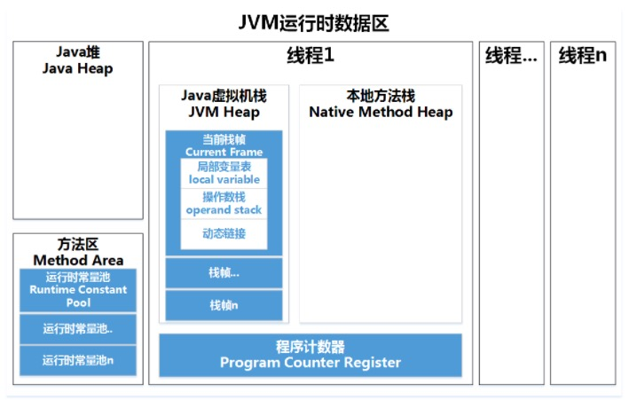

# 运行时数据区域 [Back to Main](README.md)
  
  JVM载执行Java程序的过程中会把它所管理的内存划分为若干个不同的数据区域。具体如下图所示：
  
  
  * 程序计数器（Program Counter Register）
    
    程序计数器（Program Counter Register）是一块较小的内存空间，可以看作是当前线程所执行的字节码的行号指示器。在虚拟机概念模型中，字节码解释器工作时就是通过改变计数器的值来选取下一条需要执行的字节码指令，分支、循环、跳转、异常处理、线程恢复等基础功能都需要依赖这个计数器来完成。
    
    程序计数器是一块“线程私有”的内存，如上文的图所示，每条线程都有一个独立的程序计数器，各条线程之间的计数器互不影响，独立存储。这样设计使得在多线程环境下，线程切换后能恢复到正确的执行位置。
    
    如果线程正在执行的是一个Java方法，这个计数器记录的是正在执行的虚拟机字节码指令的地址；若执行的是Native方法，则计数器为空（Undefined）（因为对于Native方法而言，它的方法体并不是由Java字节码构成的，自然无法应用上述的“字节码指令的地址”的概念）。程序计数器也是唯一一个在Java虚拟机规范中没有规定任何OutOfMemoryError情况的内存区域。
    
  * Java虚拟机栈（Java Virtual Machine Stacks）
    
    Java虚拟机栈（Java Virtual Machine Stacks）描述的是Java方法执行的内存模型：每个方法在执行的同时都会创建一个栈帧（Stack Frame），栈帧中存储着<b>局部变量表、操作数栈、动态链接、方法出口</b>等信息。每一个方法从调用直至执行完成的过程，会对应一个栈帧在虚拟机栈中入栈到出栈的过程。与程序计数器一样，Java虚拟机栈也是线程私有的。
    * 局部变量表
        - 基本数据类型(boolen、byte、char、short、int、 float、 long、double）
        - 对象引用（reference类型，它不等于对象本身，可能是一个指向对象起始地址的指针，也可能是指向一个代表对象的句柄或其他与此对象相关的位置）
        - returnAddress类型（指向了一条字节码指令的地址）
    * 两种异常状况
        - StackOverflowError：线程请求的栈深度大于虚拟机所允许的深度，将会抛出此异常
        - OutOfMemoryError：当可动态扩展的虚拟机栈在扩展时无法申请到足够的内存，就会抛出该异常    
  * 本地方法栈（Native Method Stack）
    
    本地方法栈（Native Method Stack）与Java虚拟机栈作用很相似，它们的区别在于虚拟机栈为虚拟机执行Java方法（即字节码）服务，而本地方法栈则为虚拟机使用到的Native方法服务。
    
    在虚拟机规范中对本地方法栈中使用的语言、方式和数据结构并无强制规定，因此具体的虚拟机可实现它。甚至有的虚拟机（Sun HotSpot虚拟机）直接把本地方法栈和虚拟机栈合二为一。与虚拟机一样，本地方法栈会抛出StackOverflowError和OutOfMemoryError异常。 
    
  * Java堆（Heap）
    
    Java堆（Heap）是Java虚拟机所管理的内存中最大的一块，它被所有线程共享的，在虚拟机启动时创建。此内存区域唯一的目的是存放对象实例，几乎所有的对象实例都在这里分配内存，且每次分配的空间是不定长的。在Heap 中分配一定的内存来保存对象实例，实际上只是保存对象实例的属性值，属性的类型和对象本身的类型标记等，并不保存对象的方法（方法是指令，保存在Stack中）,在Heap 中分配一定的内存保存对象实例和对象的序列化比较类似。对象实例在Heap 中分配好以后，需要在Stack中保存一个4字节的Heap 内存地址，用来定位该对象实例在Heap 中的位置，便于找到该对象实例。
        
       * 新生代（Young）： 新生成的对象优先存放在新生代中，新生代对象朝生夕死，存活率很低。在新生代中，常规应用进行一次垃圾收集一般可以回收70% ~ 95% 的空间，回收效率很高。新生代又可细分为Eden空间、From Survivor空间、To Survivor空间，默认比例为8:1:1。它们的具体作用将在下一篇文章讲解GC时介绍。
       * 老年代（Tenured/Old）：在新生代中经历了多次（具体看虚拟机配置的阀值）GC后仍然存活下来的对象会进入老年代中。老年代中的对象生命周期较长，存活率比较高，在老年代中进行GC的频率相对而言较低，而且回收的速度也比较慢。
       * 永久代（Perm）：永久代存储类信息、常量、静态变量、即时编译器编译后的代码等数据，对这一区域而言，Java虚拟机规范指出可以不进行垃圾收集，一般而言不会进行垃圾回收。
            - 类信息
            - 常量
            - 静态变量(类变量)
    
  * 方法区（Method Area）
    
    方法区（Method Area）与Java堆一样，是各个线程共享的内存区域。Object Class Data(类定义数据)是存储在方法区的，此外，常量、静态变量、JIT编译后的代码也存储在方法区。
    * 存储的信息
        - 常量、
        - 静态变量、
        - JIT编译后的代码
    * JDK 1.8以前的永久代（PermGen）
        
        如果运行时有大量的类产生，可能会导致方法区被填满，直至溢出。常见的应用场景如：
        
        - Spring和ORM框架使用CGLib操纵字节码对类进行增强，增强的类越多，就需要越大的方法区来保证动态生成的Class可以加载入内存。
        - 大量JSP或动态产生JSP文件的应用（JSP第一次运行时需要编译为Java类）。
        - 基于OSGi的应用（即使是同一个类文件，被不同的类加载器加载也会视为不同的类）。 ……
        
        这些都会导致方法区溢出，报出java.lang.OutOfMemoryError: PermGen space。
    * JDK 1.8的元空间（Metaspace）
        
        在JDK 1.8中，HotSpot虚拟机设计团队为了促进HotSpot与 JRockit的融合，修改了方法区的实现，移除了永久代，选择使用本地化的内存空间（而不是JVM的内存空间）存放类的元数据，这个空间叫做元空间（Metaspace）。
    * 运行时常量池（Runtime Constant Pool）
        
        Class文件中除了有类的版本、字段、方法、接口等描述信息外，还有一项信息是常量池（Constant Pool Table），用于存放编译期生成的各种字面量和符号引用，这部分内容将在类加载后进入方法区的运行时常量池存放。
  * 直接内存
 
       直接内存（Direct Memory）并不是虚拟机运行时数据区的一部分，也不是Java虚拟机规范中定义的内存区域。

# HotSpot中的对象
   * 对象的创建
        - new关键字
        - 使用newInstance()方法 这里包括Class类的newInstance()方法和Constructor类的newInstance()方法（前者其实也是调用的后者）
        - 使用clone()方法 要使用clone()方法我们必须实现实现Cloneable接口，用clone()方法创建对象并不会调用任何构造函数。即我们所说的浅拷贝
        - 反序列化 要实现反序列化我们需要让我们的类实现Serializable接口。当我们序列化和反序列化一个对象，JVM会给我们创建一个单独的对象，在反序列化时，JVM创建对象并不会调用任何构造函数。即我们所说的深拷贝。
   * 当虚拟机遇到new指令的时候对象是如何创建的
       - 类加载检查
        
         虚拟机遇到一条new指令时，首先将去检查这个指令的参数是否能在常量池中定位到一个类的符号引用，并且检查这个符号引用代表的类是否已被加载、解析和初始化过的，如果没有，则必须先执行相应的类加载过程
       - 分配内存
            - Java堆中内存绝对规整
        
              所有用过的内存都被放在一边，空闲的内存被放在另一边，中间放着一个指针作为分界点的指示器，那所分配内存就仅仅是把那个指针向空闲空间那边挪动一段与对象大小相等的距离，这种分配方式称为“指针碰撞”（Bump The Pointer）
            - Java堆中的内存不规整 
        
              已被使用的内存和空闲的内存相互交错，那就没有办法简单的进行指针碰撞了，虚拟机就必须维护一个列表，记录哪些内存块是可用的，在分配的时候从列表中找到一块足够大的空间划分给对象实例，并更新列表上的记录，这种分配方式称为“空闲列表”（Free List）。
              多线程并发时导致内存分配错乱问题，有如下两个方案
                - <b>对分配内存空间的动作进行同步</b> 实际上虚拟机是采用CAS配上失败重试的方式保证更新操作的原子性。
                - 把内存分配的动作按照线程划分在不同的空间之中进行 即每个线程在Java堆中预先分配一小块内存，称为本地线程分配缓冲（TLAB ，Thread Local Allocation Buffer），哪个线程要分配内存，就在哪个线程的TLAB上分配，只有TLAB用完，分配新的TLAB时才需要同步锁定。
       - 初始化
       
         内存分配完成之后，虚拟机需要将分配到的内存空间都初始化为零值（不包括对象头），如果使用TLAB的话，这一个工作也可以提前至TLAB分配时进行。这步操作保证了对象的实例字段在Java代码中可以不赋初始值就直接使用。
       - 设置对象头
       
         虚拟机要设置对象的信息（如这个对象是哪个类的实例、如何才能找到类的元数据信息、对象的哈希码、对象的GC分代年龄等信息）并存放在对象的对象头（Object Header）中。根据虚拟机当前的运行状态的不同，如是否启用偏向锁等，对象头会有不同的设置方式。
       - 执行<init>方法
       
         在上面工作都完成之后，在虚拟机的视角来看，一个新的对象已经产生了。但是在Java程序的视角看来，对象创建才刚刚开始——<init>方法还没有执行，所有的字段都还为零值。所以一般来说（由字节码中是否跟随有invokespecial指令所决定），new指令之后会接着执行<init>方法，把对象按照程序员的意愿进行初始化，这样一个真正可用的对象才算完全产生出来。
   * 对象的内存布局
       - 对象头
       - 实例数据
       - 对齐填充
   * 对象的访问定位
        - 主流的访问方式有使用句柄和直接指针两种。
            - 使用句柄访问
            - 使用直接指针访问
# Return
 - Java虚拟机 [JVM](README.md)